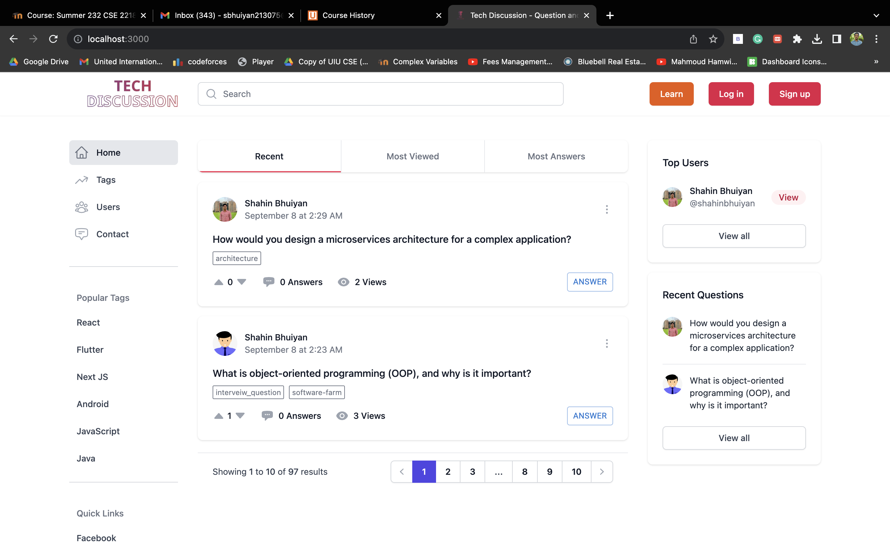
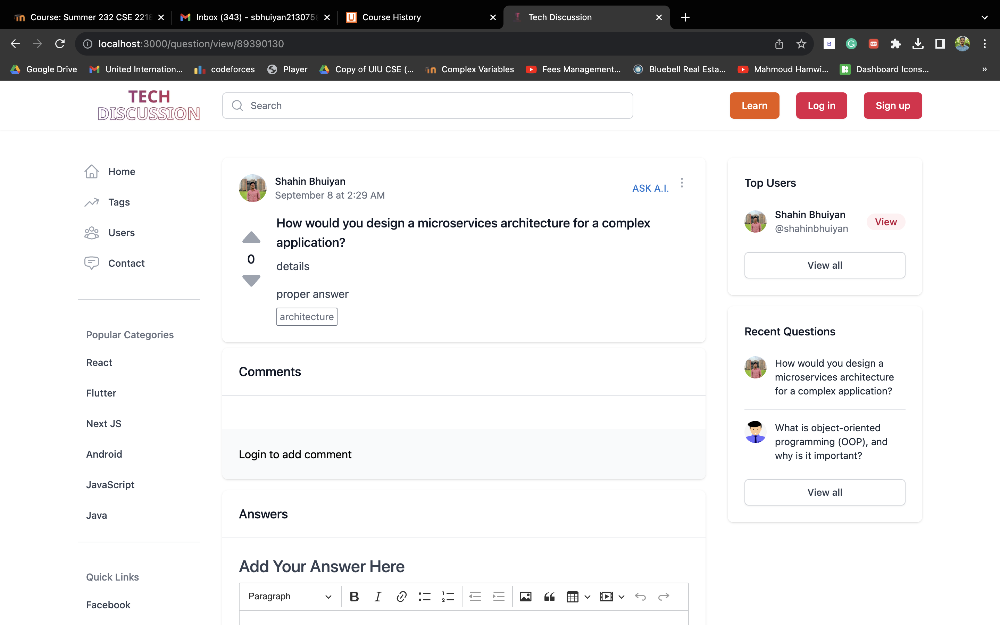
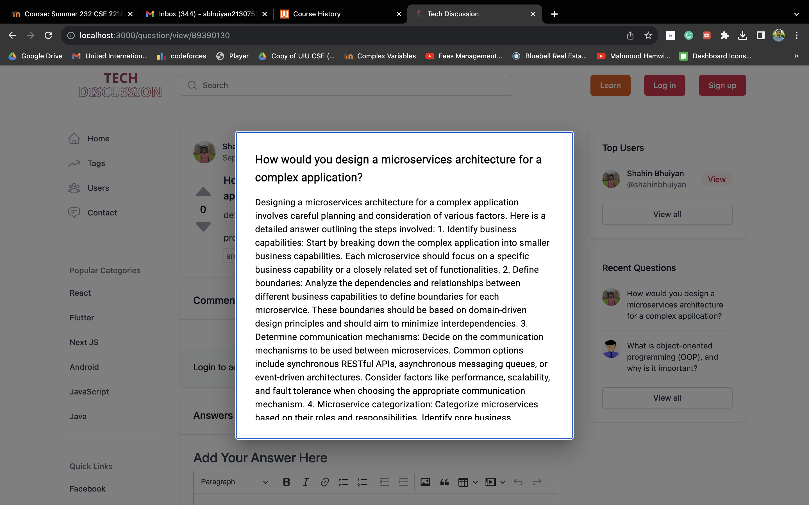

# Tech_Discussion

## Features
- Anyone can ask question or share blogs.
- See other Blogs/Questins and reply or comment there.
- Openai integreted to the every question, user can click ask_ai button & ai will answer those indiviual question. (Expire in Dec 2023)
- Authentication also integreated, user have to sign-in/sign-up in order to ask question or post blog.
- Handle each user's profile.

## Technology
- nextjs
- next-routing
- ckeditor
- headlessui
- material-ui/MUI
- axios
- dotenv
- openai
- mongoose
- sharp
- sweetalert

### Take a look -->
- homepage

- view question

- ASK_AI

